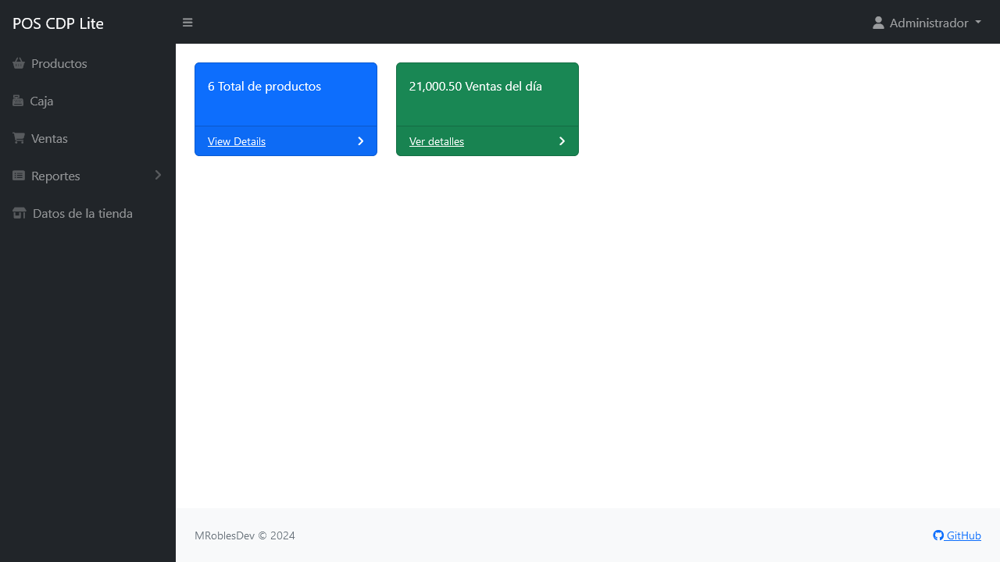
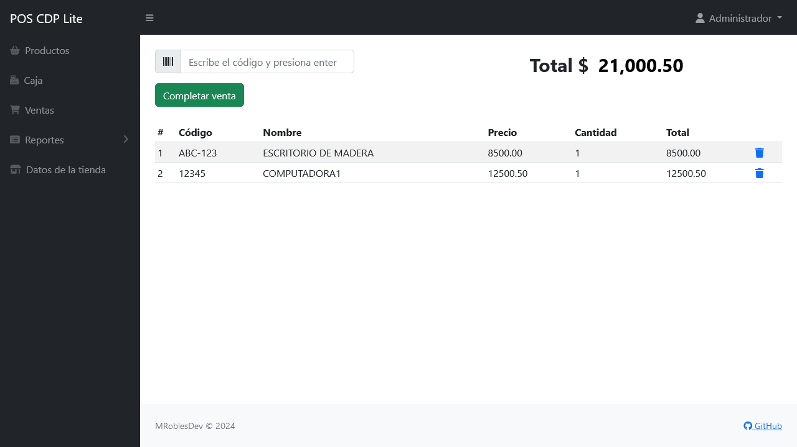
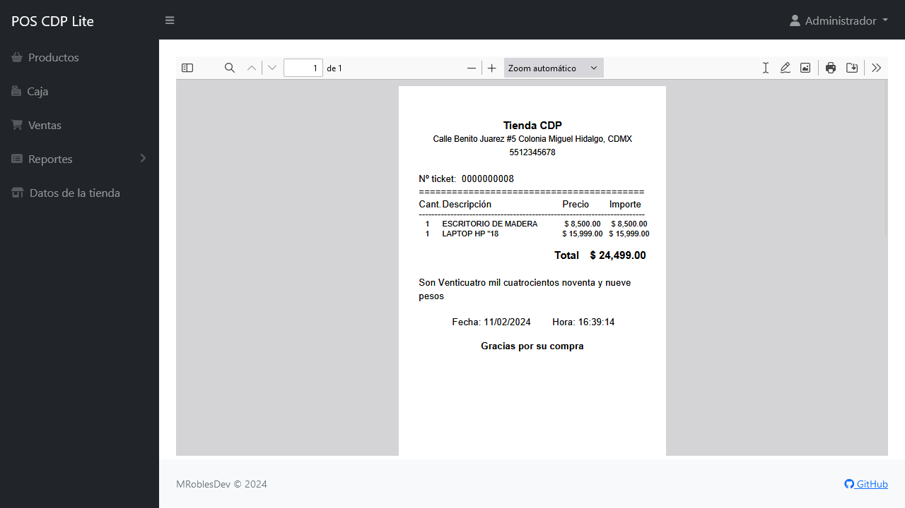
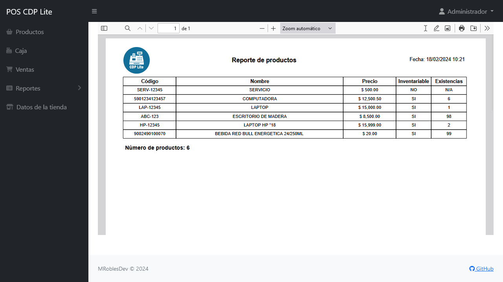

# Sistema de Punto de Venta CDP Lite

El sistema de punto de venta CDP Lite es una aplicación web basada en el lenguaje PHP y MySQL con la cual puedes mantener el control de inventario y venta de productos en una tienda. Este proyecto fue desarrollado utilizando CodeIgniter 4.

## Requisitos

- Servidor web (Apache Server 2.4 o superior).
- PHP 7.4 o superior.
  - Extensión [intl](http://php.net/manual/en/intl.requirements.php)
  - Extensión [mbstring](http://php.net/manual/en/mbstring.installation.php)
- MySQL 5.6 o superior.
- Composer (opcional)
- Git (opcional)

## Instalación
### 1. Descarga:

#### Composer

```sh-session
$ composer create-project mroblesdev/pos-cdp-lite
```

#### Git

```sh-session
$ git clone https://github.com/mroblesdev/pos-cdp-lite.git
$ cd pos-cdp-lite
$ composer install --no-dev
```

### Descarga manual

Alternativamente, si no está utilizando Composer, puede descargarlo como un archivo zip, luego copie el contenido de la carpeta a su servidor web. https://github.com/mroblesdev/pos-cdp-lite/releases

### 2. Configuración del entorno:

- Crear una base de datos

```
mysql> CREATE DATABASE IF NOT EXISTS `pos-cdp-lite` DEFAULT CHARACTER SET utf8mb4 COLLATE utf8mb4_unicode_ci;
```

- Copia el archivo `env` a un nuevo archivo llamado `.env`.
- Modifica el archivo `.env` según tu configuración de base de datos y otros ajustes necesarios.

```
app.baseURL = 'http://localhost/pos-cdp-lite/public/'


database.default.hostname = localhost
database.default.database = pos-cdp-lite
database.default.username = root
database.default.password = 
database.default.DBDriver = MySQLi
```

### 3. Ejecutar migraciones y seeders:
```
php spark migrate

php spark db:seed CargaSeeder
```

### 4. Ejecutar la aplicación:
```
php spark serve
``` 

Esto iniciará el servidor en http://localhost:8080 por defecto.

O en Apache Server con al dirección http://localhost/pos-cdp-lite/public

**Datos de acceso**

- **Usuario:** admin

- **Contraseña:** admin

## Características versión 1.0

- Acceso por credenciales
- Catalogo de productos
- Caja de cobro
- Generación de ticket
- Historial de ventas
  - Reimpresión de ticket
  - Cancelar ventas
- Reportes
  - Ventas
  - Productos
- Configuración del sistema

## Demostración

Para acceder a nuestra demostración y explorar todas las funcionalidades del Punto de Venta CDP Lite, por favor visita https://pos-lite.sistemarv.com


## Capturas de pantalla

|   |  
| --- | --- |
|   |  
|   |  

## Contribuciones

Siéntete libre de contribuir al proyecto.

## Expresiones de Gratitud 🎁

- Comenta a otros sobre este proyecto 📢
- Invitame una cerveza 🍺 o un café ☕ [Da clic aquí](https://www.paypal.com/paypalme/markorobles?locale.x=es_XC.).

## Licencia

Este proyecto está bajo la Licencia [MIT](LICENSE).
