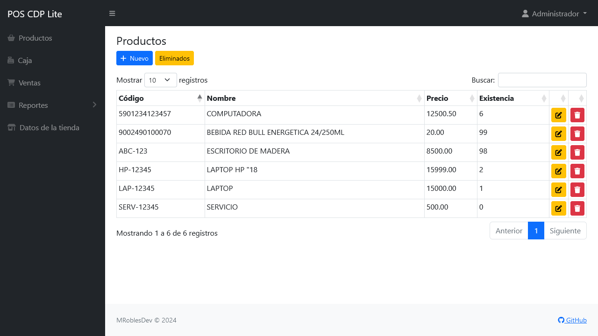

# Sistema de Punto de Venta CDP Lite

El sistema de punto de venta CDP Lite es una aplicación web basada en el lenguaje PHP y MySQL con la cual puedes mantener el control de inventario y venta de productos en una tienda. Este proyecto fue desarrollado utilizando CodeIgniter 4.

El sistema cuenta con un catalogo de productos, módulo de caja, ventas y reportes.

Con una interfaz adaptable que hace la administración del sistema más eficiente y permite la navegación móvil (diseño responsivo).

## Requisitos

- Servidor web (Apache Server 2.4 o superior).
- PHP 7.4 o superior.
  - Extensión [intl](http://php.net/manual/en/intl.requirements.php)
  - Extensión [mbstring](http://php.net/manual/en/mbstring.installation.php)
- MySQL 5.6 o superior.
- Composer
- Git (opcional)

## Características versión 1.0

- Acceso por credenciales
- Catalogo de productos
- Caja de cobro
- Generación de ticket
- Historial de ventas
  - Reimpresión de ticket
  - Cancelar ventas
- Reportes
  - Ventas
  - Productos
- Configuración del sistema

## Capturas de pantalla

|   |  
| --- | --- |
|   |  
|   |  

## Contribuciones

Siéntete libre de contribuir al proyecto.

## Licencia

Este proyecto está bajo la Licencia [MIT](LICENSE).
